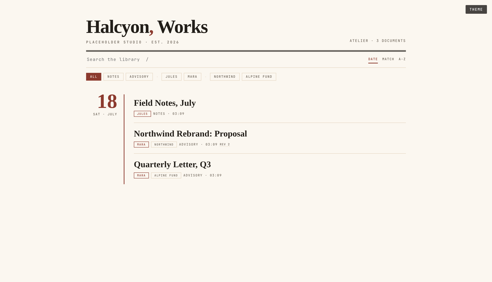
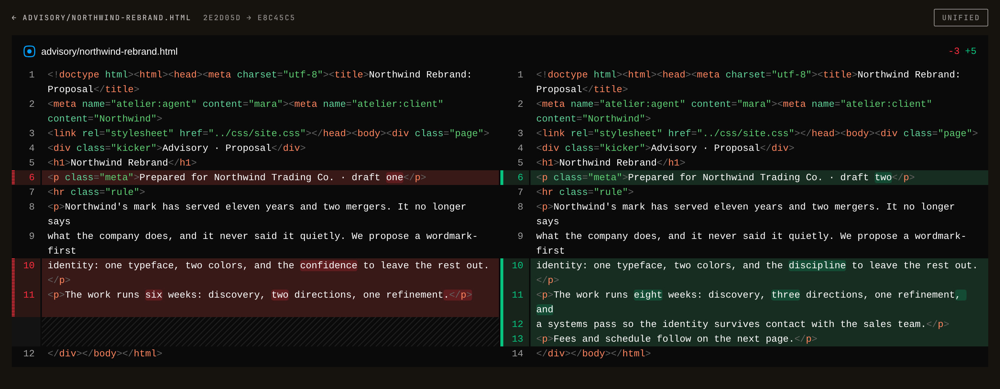
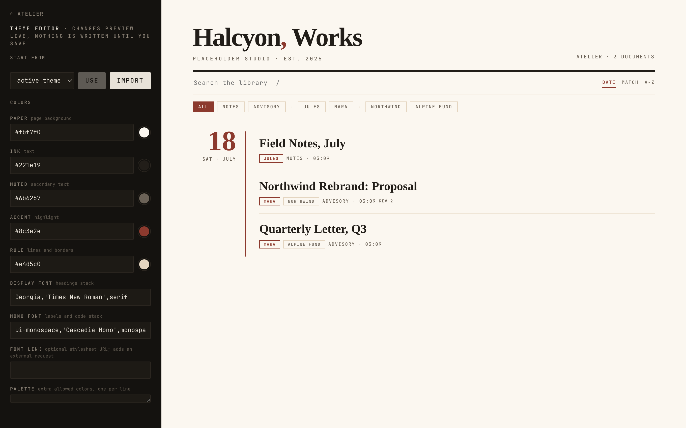

# atelier

A workshop for documents: one binary that scaffolds, lints, serves,
time-travels, and exports branded HTML pages.

Your agents deliver here. The bundled Claude Code skill routes their
plans, specs, proposals, and mockups into the library as branded pages:
indexed and searchable the moment they exist, versioned by git, served
on your own network, themed like they came from your studio. Because
they did. `./install.sh` links the skill; that is the whole setup.

    scaffold      new pages from your own masters, born on-brand
    serve         hot reload, search, clean URLs, chips
    time travel   any page, at any commit, straight out of git
    diff          any two versions, side by side, highlighted
    theme         live editor, five presets, themes as portable files
    check         brand and structure linting, with opinions
    export        print-perfect PDFs, stamped and share-logged

Content and brand live in a library repo of their own; this repo ships
the tools and stays plain.

    this repo                      your library
    ───────────────────            ────────────────────────────────
    atelier, one binary      ──►   atelier.json         the manifest
    five neutral themes            brand-guidelines.md  the voice
    the claude code skill          templates/           the masters
    nothing confidential           themes/              your themes
                                   *.html               the work

## Start here

    mkdir studio && cd studio
    echo '{ "name": "My Studio", "theme": "porcelain" }' > atelier.json
    atelier serve

That is a working library. The index builds itself, pages hot-reload,
and the Theme chip in the corner opens a live editor. Everything above
in the screenshot, including the accent on the wordmark's comma, came
from that one line of manifest.

## Time travel and diffs

In a git repo, every served page carries a history chip. Pick a commit
and the page re-renders as of that moment under `/@<sha>/`, assets
included, straight out of git; nothing is written to disk. Pick two
versions instead and read the change, split or stacked, highlighted by
an embedded [@pierre/diffs](https://diffs.com) (Apache-2.0, vendored,
no external requests).

## Themes

    "theme": "porcelain"                                   adopt by name
    "theme": { "base": "porcelain", "accent": "#0b5d3b" }  start there, tweak
    "theme": { "paper": "#FFFCF8", "ink": "#1b1a17" }      spell it out

Names check the library's `themes/` first, then the built-ins
(`gallery` `ledger` `noir` `porcelain` `terminal`), so a same-named
file forks a preset. A theme is one JSON file of CSS values; it
travels as a file, and the editor at `/__theme` imports, previews,
saves, and applies without you touching a config.

Theme save and apply are two of the server's three write surfaces (the
third is remote authoring, below), each narrow and audited; everything
else is GET. New pages scaffold on-brand via `{{BRAND_*}}` placeholders.
A good new preset is a welcome one-file PR.

The full field list

`paper`, `ink`, `muted`, `accent`, `rule` (CSS colors),
`display_font`, `mono_font` (font stacks), `font_link` (a stylesheet
URL, emitted as a `<link>` when set), and `palette`, an array of extra
colors `check` will accept. Every field defaults to a neutral look
with no external requests.

## Checking

`atelier check` errors on missing titles, missing author stamps,
broken links, and em dashes (write like a person). It warns on colors
and fonts that wander off brand. Every rule can be switched off in the
manifest; the defaults have opinions.

Pages may carry `<meta name="atelier:KEY" content="...">` tags; all of
it is searchable from the index, and `atelier:agent` / `atelier:client`
become stamps and filter chips on the ledger.

## Remote authoring

The running server is also an MCP server: `POST /mcp`, streamable HTTP,
stateless. Teammates point whatever agent they use at it and author
documents in the library without installing anything; the binary and
the library stay on the serve machine.

    atelier connect

prints the exact join command for this machine
(`claude mcp add --transport http atelier http://<host>:<port>/mcp`, or
point any streamable-HTTP MCP client at the same URL); the serve banner
names the endpoint too. The tools mirror the CLI: `get_brand_guidelines`, `list_documents`, `read_document`,
`check_document`, `list_templates`, `write_document`,
`new_from_template`, `share_document`, `render_pdf`, `reindex`. The
server's `initialize` response carries the authoring contract; agents
that honor instructions need no further briefing.

**The port trusts its network.** There is no authentication by design:
run the server only on a trusted private network (a Tailscale tailnet,
a LAN you control) and never expose it further. Within that boundary,
every mutation is path-fenced, size-capped, serialized, and attributed:

- Writes may only create or update documents (`.html`, `.css`, `.js`,
  `.svg`, `.md`, `.txt`). The generated `index.html`, the manifest,
  `shares.log`, `brand-guidelines.md`, `themes/`, and `shares/` are
  not remotely writable.
- Pass `commit_message` and the server commits the change to the
  library repo. When the host runs Tailscale, the commit is authored
  `<user> via <machine>` from `tailscale whois` on the peer address
  (the committer stays the repository's own identity), so `git log`
  answers who sent what from where. Without Tailscale, attribution
  degrades gracefully to the peer address; nothing else changes.
- Exports land in `<library>/shares/`: served over HTTP, listed in
  `shares.log` (with a column naming the submitter), kept off the
  ledger. Rendering needs Chromium on the serve machine.

One small shadow: the `/mcp` path wins over a root-level file that
would serve there, the same shadowing as `/__theme`. Requests need a
`Content-Length` (no chunked bodies).

## Commands

    atelier new <template> <dest> [--set K=V]   scaffold from a master
    atelier index                               rebuild index.html
    atelier check [page]                        lint brand and structure
    atelier pdf <page> [-o out] [--rev sha]     print via headless Chromium
    atelier share <page> [--for X]              stamped PDF + share log
    atelier serve [path] [--port N]             serve, watch, time travel
    atelier connect                             print the MCP join command
    atelier theme list|show <name>              browse themes

Every command finds the library the same way: `--library`, else the
nearest ancestor with `atelier.json`, else `~/.config/atelier/config`.

## Install and hack

    ./install.sh [library-path]     build to ~/.local/bin, link the skill
    cd cli && zig build test        the whole suite, colocated with the code

Zig 0.17-dev. `CLAUDE.md` is the map. MIT licensed.
